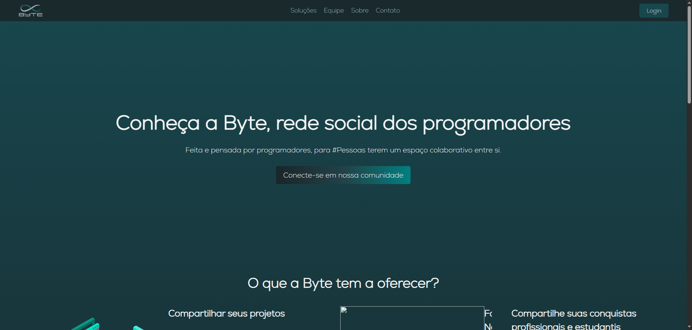

# byte

Back-end + Front-End do Byte



Como usar:

- Primeiro tenha o Git Instalado no seu Windows, Linux, Mac ou Android.
- Tenha o XAMPP ou similiar instalado.
- Abra a pasta htdocs
- Abra o CMD/Terminal/Powershell e digite ```git clone https://github.com/ByteTCC/byte.git```
- Acesse localhost/phpmyadmin/ no navegador
- Coloque o conteúdo do arquivo SQL do repositório bytedb (https://github.com/ByteTCC/bytedb) no campo SQL do PHPMyAdmin e execute.
- Caso já exista um banco de dados chamado bd_byte, delete ele para colocar a versão mais atualizada (se tiver) com ```DROP DATABASE bd_Byte;``` no campo SQL sem bancos de dados abertos.
- Depois disso já está pronto para trabalhar no Byte.

Como colocar o meu Git/Github na máquina:
    [GUIA PARA CONFIGURAR O GIT + GITHUB + VSCODE](https://github.com/ByteTCC/byte/blob/main/docs/git_guide.md)