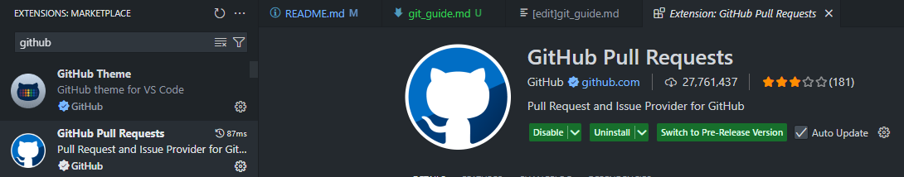
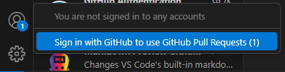
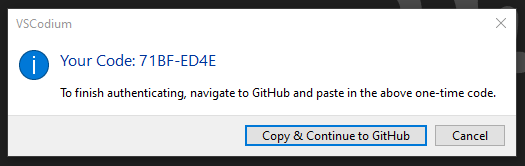
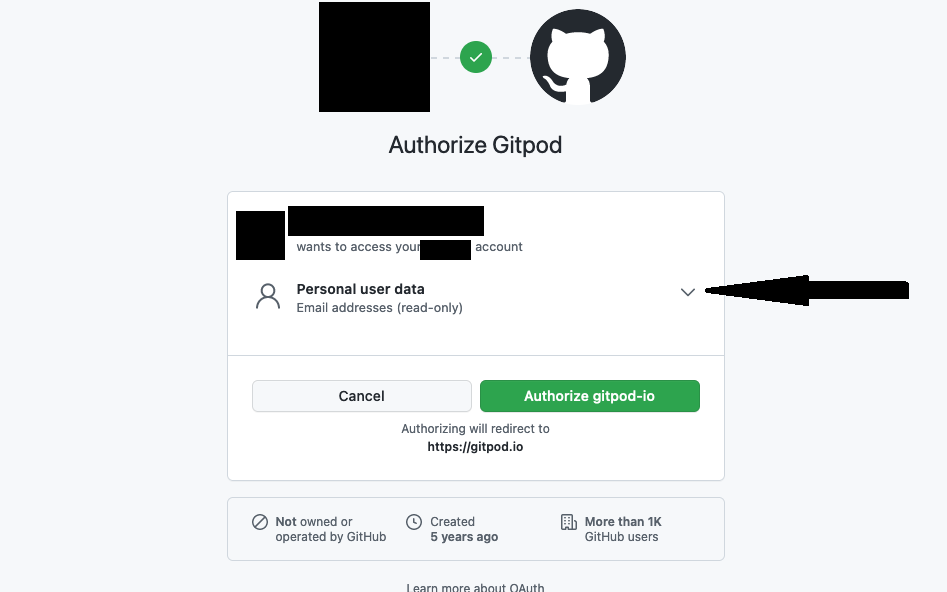
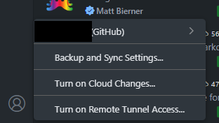
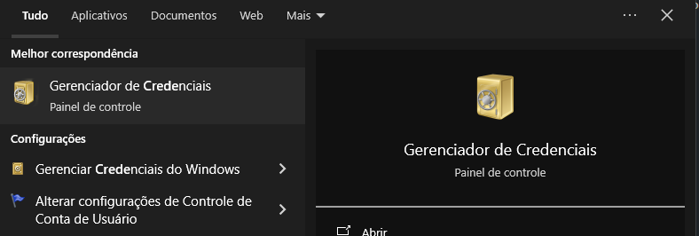
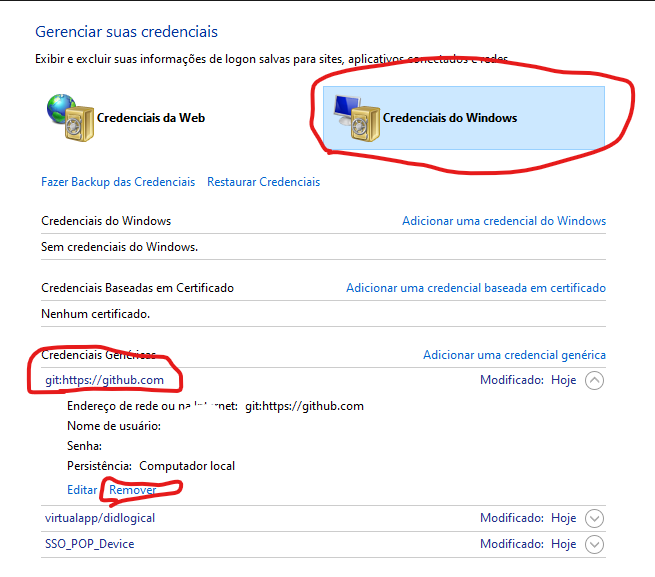
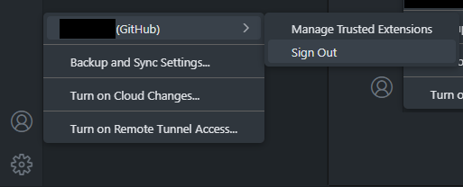

# Como configurar o Git + GitHub no VSCode.

Tenha o Git (https://git-scm.com/downloads/win) instalado no seu computador.

Nos computadores do curso ele já vem instalado.

Primeiro passo:

* Abra o seu VSCode.
* Procure a extensão "Github Pull Requests" e instale:

  
* Depois de instalado, nota-se que no canto esquerdo que possui os ícones, você verá um ícone do GitHub:


* No canto esquerdo INFERIOR você verá o ícone de conta, clique nele e procure por "Sign in with GitHub to uso Github Pull Requests":



* Ao clicar nele será aberto uma janela para abrir uma página no navegador para realizar a autenticação:



* Geralmente existem duas possibilidades, a primeira, a da imagem acima vai falar para você colocar um código quando você autenticar com o github no navegador, para SINCRONIZAR o VSCode com o Github, e a segunda é mais fácil que não pedirá código e você terá apenas que se autenticar e dar permissão:



* CERTIFIQUE-SE que nessa hora, você clicará no dropdown apontado na imagem acima e permitirá também que a extensão acesse a organização ByteTCC.
* Depois de acessar com sucesso você verá que no menu na parte inferior esquerda do VSCode está a sua conta do Github autenticada na extensão:



* Essa etapa é necessária apenas se você estiver usando Windows nos computadores do curso:
* No menu iniciar do Windows pesquise por "Gerenciador de credenciais":



* Na imagem acima, ao abrir, clique em "Credenciais do Windows", procure por "git:https://github.com" em "Credenciais Genéricas" e clique em Remover, para remover credenciais salvas do Git associadas a contas do Github, isso é para evitar erros na hora de enviar modificações no repositório e também para retirar suas credenciais Git do Windows para evitar que alguém mal intencionado use sua conta para fazer alterações indevidas nos repositórios.
* Abra o CMD ou Powershell sem permissão de adminstrador e coloque os seguintes comandos Git, um por um:
```console
$ git config --global user.name "SEU_USERNAME"
```

* No lugar de SEU_USERNAME coloque o nome de usuário da sua conta do Github.
```console
  $ git config --global user.email fulanodetal@exemplo.br
```
* Agora no lugar de fulanodetal@exemplo.br coloque o seu e-mail usado na sua conta do Github.


